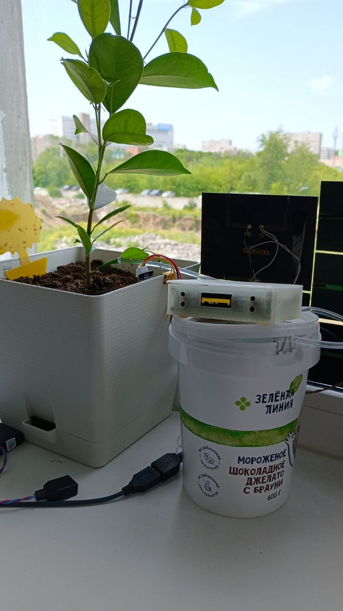
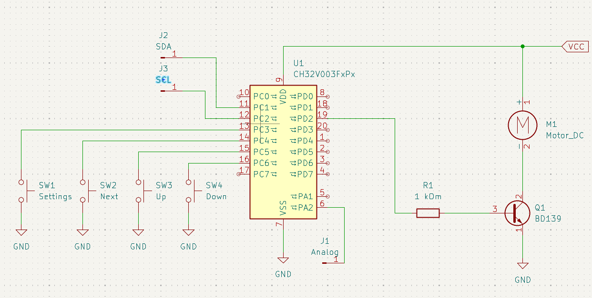
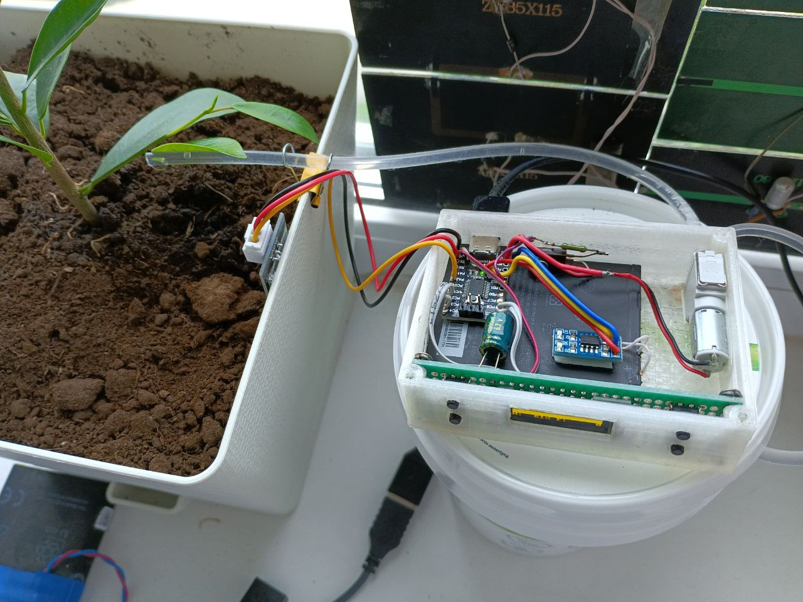

# ch32-auto-watering
Hello, the goal of this project was to create an automatic watering system for indoor plants using inexpensive and readily available components that can be ordered on AliExpress for final production. The system is based on the CH32v003 SoC, the most common board without a quartz crystal (at the time of writing, it costs 0.5$).

## Electrical schema
The device's electrical circuit uses ready-made blocks, including a key for controlling the automatic irrigation pump. It would be better to build it using a modern element base of field-effect transistors. However, I had a lot of Soviet transistors, such as the KT601, KT602, and KT815, which I used to assemble the key for controlling the pump.

As you can see in the image below, most of the prototype device is surface mounted and is not yet finished, as the project is still being refined.

