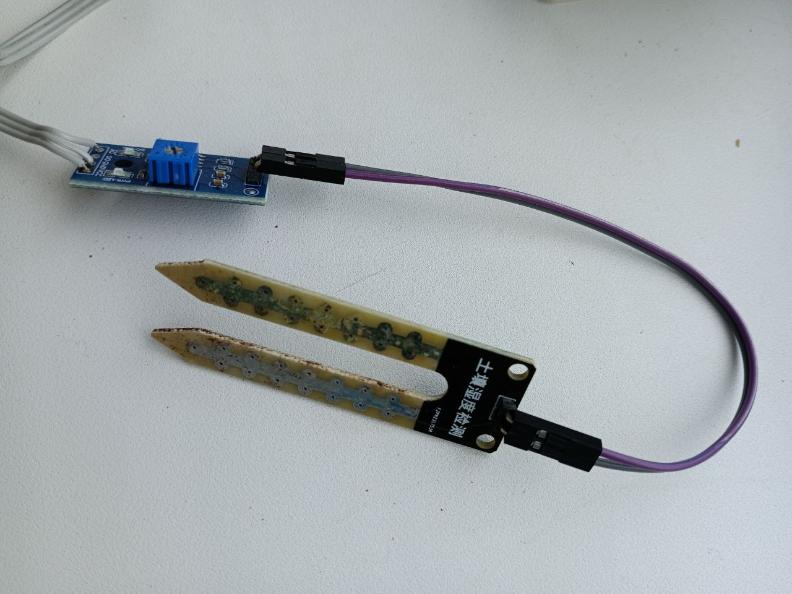
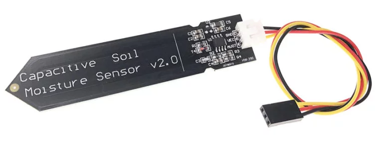
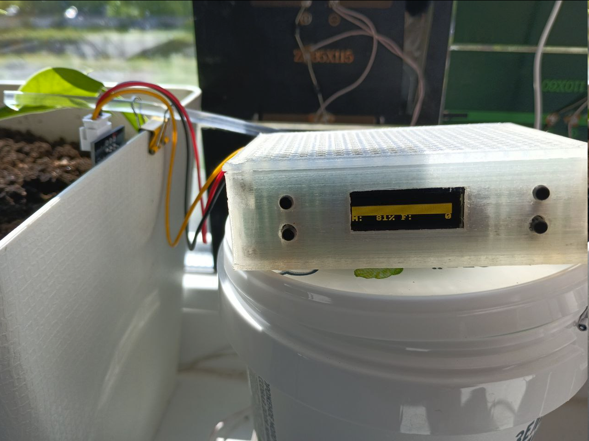

# ch32-auto-watering
Hello, the goal of this project was to create an automatic watering system for indoor plants using inexpensive and readily available components that can be ordered on AliExpress for final production. The system is based on the CH32v003 SoC, the most common board without a quartz crystal (at the time of writing, it costs 0.5$).
Here is device photo.

## Electrical schema
The device's electrical circuit uses ready-made blocks, including a key for controlling the automatic irrigation pump. It would be better to build it using a modern element base of field-effect transistors. However, I had a lot of Soviet transistors, such as the KT601, KT602, and KT815, which I used to assemble the key for controlling the pump.
Here is main electrical schema.

As you can see in the image below, most of the prototype device is surface mounted and is not yet finished, as the project is still being refined.
Here is main block.

### Soil moisture sensor
Initially, I used a common resistive soil moisture sensor for the device and, as shown in the diagram above, fed the signal to the ADC input. It was convenient for measuring data, from 0 V to a supply voltage of 3.3 V. The controller has a 10-bit ADC, so the values ​​ranged from 0 to 1023 and were easy to convert to moisture percentages. However, something went wrong and the sensor malfunctioned.
Here is result.

The process of sensor electrode oxidation, as it turns out, is well-known. So, the solution is - using capacitive sensors.

### Oled display
To display the data, I chose an OLED display with a 128x32 resolution. It displays current readings and a moisture graph over time. A target soil moisture value can be specified in the settings. The display shows two parameters: M (soil moisture) and F (flood value). The display itself is connected via two wires and operates using the I2C protocol.
The price of oled display 1$.

### Pump
So, if the soil moisture is insufficient, the device begins to continuously dispense water until a set time threshold is reached, or until the soil reaches the desired moisture level. The time threshold is configured in the source code. I used the smallest **CJWP08** pump, which costs about 0.5$, so I set the threshold to 30 seconds of continuous watering. The pump then switches to drip mode, releasing a drop of water every set time until the desired moisture level is reached.
